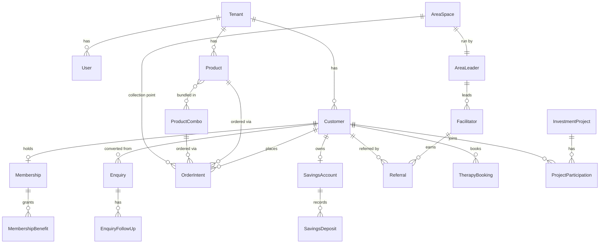

# Domain Model: aQua Lifestyle Club Platform

Entities marked **(existing)** are implemented in `AqualLifeStyle.Core`; entities marked **(proposed)** are required by the business documents but not yet modelled.

## Core Entities & Relationships



## Existing Entities

### Customer (existing)
```typescript
interface Customer {
  id: number;
  userId: number;           // links to the ABP user that owns personal details
  name: string;
  email: EmailAddress;      // value object
  membershipId?: number;
}
```

Customer personal details have one source of truth on the linked ABP user:
`Name` stores first name, `Surname` stores surname, `PhoneNumber` stores the
contact number, and the Aqua extension `HomeAddress` stores the home address.
The customer `name` and `email` fields remain synchronized compatibility/search
values; phone and address are not duplicated on `Customer`.

### Membership (existing)
```typescript
interface Membership {
  id: number;
  type: MembershipType;         // Jasper | Onyx | AQGreen | BusinessPremier
  activationDate?: DateTime;
  monthlyObligationAmount: number;   // tier-specific
  // obligation tracking: SetMonthlyObligation, MarkObligationMet, IsObligationMetForMonth
}
```

### TierBenefits (existing value object)
```typescript
interface TierBenefits {
  orderWindow: { openDay: number; closeDay: number };
  savingsWindow: { openDay: number; closeDay: number; lockedFrom: number; lockedTo: number };
  pricingDiscountPercent: number;
  interestRatePercent: number;
  concurrentOrderLimit: number;
  referralCommissionPercent: number;
  profitSharePercent: number;
}
```

### Product (existing)
```typescript
interface Product {
  id: number;
  name: string;
  price: number;
  isActive: boolean;
  // eligibility enforced by ProductEligibilityManager (membership-aware)
}
```

### OrderIntent (existing)
```typescript
interface OrderIntent {
  id: number;
  customerId: number;
  productId: number;
  status: OrderIntentStatus;    // Draft | Reserved | Cancelled | Completed
}
```

### Enquiry / EnquiryFollowUp (existing)
```typescript
interface Enquiry {
  id: number;
  subject: string;
  message: string;
  status: EnquiryStatus;         // Pending | Responded | Closed
  assignedToMemberId?: number;
  isConverted: boolean;
  convertedAt?: DateTime;
}

interface EnquiryFollowUp {
  id: number;
  enquiryId: number;
  outcome: 'Interested' | 'Considering' | 'NotInterested' | 'Converted' | 'Lost';
  notes: string;
  createdAt: DateTime;
}
```

### SavingsAccount (existing — domain object only, not persisted)
```typescript
interface SavingsAccount {
  id: number;
  customerId: number;
  balance: number;
}
```

## Proposed Entities (from business documents)

### ProductCombo (proposed)
```typescript
interface ProductCombo {
  id: number;
  name: string;                  // "Combo 4", "Combo 2", ...
  items: { productId: number; quantity: number }[];
  memberPrice: Money;            // AQGreen/monthly set price (e.g. Combo 4 = R378)
  jasperPrice: Money;            // Jasper plan price (e.g. Combo 4 = R417)
}
```

### SavingsDeposit (proposed)
```typescript
interface SavingsDeposit {
  id: number;
  savingsAccountId: number;
  amount: Money;
  depositedOn: DateTime;         // must fall within 1st–15th window
  proofOfPaymentRef: string;
  verifiedByAdmin: boolean;
}
```

### ClubAccount (proposed — extends SavingsAccount semantics)
```typescript
interface ClubAccount {
  id: number;
  customerId: number;
  accountType: 'Standard' | 'ClubMillionaire' | 'BusinessPremier' | 'InvestmentProjects';
  registrationFee: Money;        // R560 / R1200 / R790 / R2500
  minimumMonthlySaving: Money;   // R310–510 / R500–600 / R1500 / R5000 security
  interestRatePercent: number;   // 20 (17 for BusinessPremier)
  firstYearLockUntil: DateTime;  // payments locked 12 months
  refundThreshold: Money;        // R1500 / R2500 / R4500 within 3 months
}
```

### SubscriptionLevel (proposed — Onyx IBA)
```typescript
interface SubscriptionLevel {
  level: 0 | 1 | 2 | 3 | 4 | 5;
  subscriptionFee: Money;              // Level 0–3: R850; Level 4: R1200
  monthlyOrderSet: string;             // Combo 4 | Combo 4 x4 | Combo 4 x8
  paymentDate: number;                 // 25th / 30th / 1st
  collectionDate: number;              // 5th / 10th / 16th
  productIncentive: Money;             // R378–R4000 aQuathz
  status: 'A' | 'B';
}
```

### AreaLeader (proposed)
```typescript
interface AreaLeader {
  id: number;
  customerId: number;
  licenseType: 'EntreLevel' | 'AreaIndependentLeader';
  licenseFee: Money;               // R750 / R2500
  rank: AreaLeaderRank;
  areaSpaceId: number;
  monthlySubscription: Money;      // R500–R5,590 by rank
  directReferrals: number;
  orderTarget: number;             // 20 → 18,000 by rank
}

enum AreaLeaderRank {
  Ruby, Emerald, Premier, Dimond, VIP,
  Presidential, ChairmansCircle, Ambassador
}
```

### AreaSpace (proposed)
```typescript
interface AreaSpace {
  id: number;
  areaLeaderId: number;
  address: string;
  status: 'Applied' | 'UnderReview' | 'Approved' | 'Suspended';
  capacity: string;                // e.g. "20 by 40"
  reviewStartedAt?: DateTime;      // 42-hour review window
  presentationsCompleted: number;  // 4 consecutive required
  startupOrdersCompleted: number;  // 20 within 4 weeks required
}
```

### Facilitator (proposed)
```typescript
interface Facilitator {
  id: number;
  customerId: number;
  areaLeaderId: number;
  rank: FacilitatorRank;
  directReferrals: number;
  indirectReferrals: number;
}

enum FacilitatorRank {
  Bronze,     // 10 direct, stage 1, R50 award
  Gold,       // 10 direct, stage 2, R250
  Pearl,      // 5 direct, stage 3, R1,250
  Sapphire,   // 5 direct, stage 4, R2,500
  Ruby,       // 20 direct, stage 5, R11,250
  Platinum,   // 10 direct, stage 6, R41,250
  PremierT60  // 60 direct total, final, R68,750
}
```

### Referral (proposed)
```typescript
interface Referral {
  id: number;
  referrerId: number;          // facilitator or member
  referredCustomerId: number;
  type: 'Direct' | 'Indirect';
  convertedAt?: DateTime;
  awardIssued: boolean;
}
```

### InvestmentProject / ProjectParticipation (proposed)
```typescript
interface InvestmentProject {
  id: number;
  name: string;                // therapy centre, stores, bottling company, lodges, ...
  companySharePercent: 60;
  poolSharePercent: 40;
}

interface ProjectParticipation {
  id: number;
  projectId: number;
  customerId: number;
  securityDeposit: Money;      // min R5000
  distributionsPaid: Money[];  // bi-quarterly equal shares of 40% pool
}
```

### TherapyBooking (proposed)
```typescript
interface TherapyBooking {
  id: number;
  customerId: number;
  packageType: 'ThreeInOne_A' | 'TwoInOne' | 'ThreeInOne_B'; // R3,160 / R1,920 / R1,495
  bookedVia: 'AreaLeader' | 'Admin';
  scheduledAt: DateTime;
}
```

## Enums (existing)

```typescript
enum MembershipType { Jasper = 0, Onyx = 1, AQGreen = 2, BusinessPremier = 3 }
enum OrderIntentStatus { Draft = 0, Reserved = 1, Cancelled = 2, Completed = 3 }
enum EnquiryStatus { Pending = 0, Responded = 1, Closed = 2 }
```

## Value Objects

```typescript
interface Money { amount: number; currency: 'ZAR' }   // proposed; prices currently plain numbers
interface EmailAddress { value: string }               // existing
```
