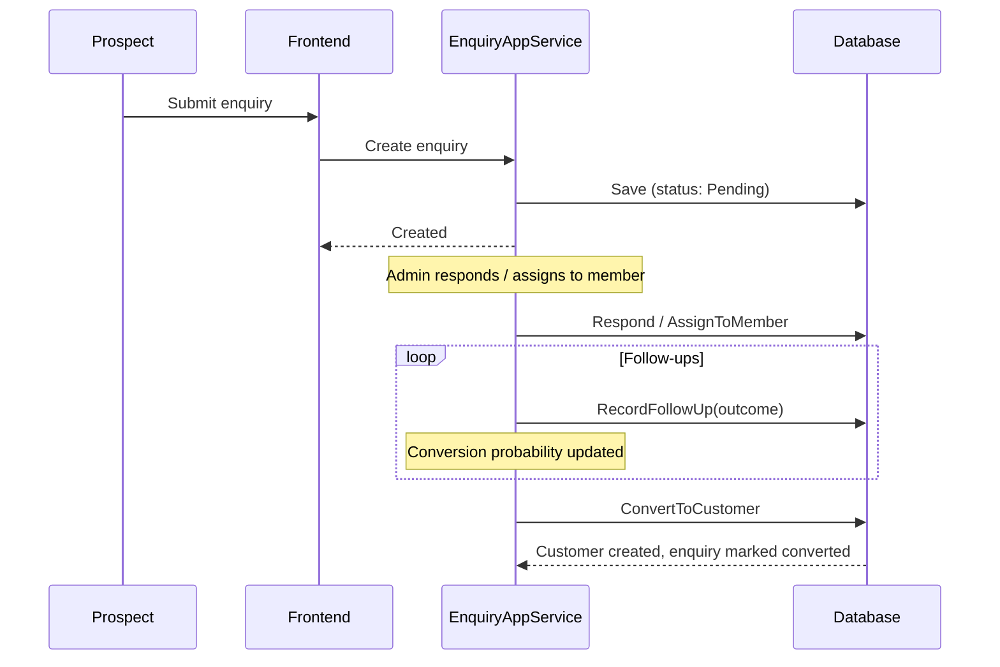
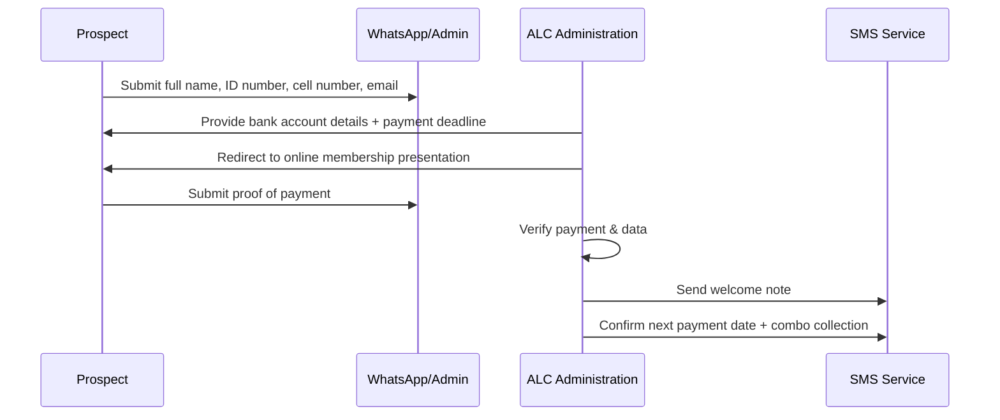
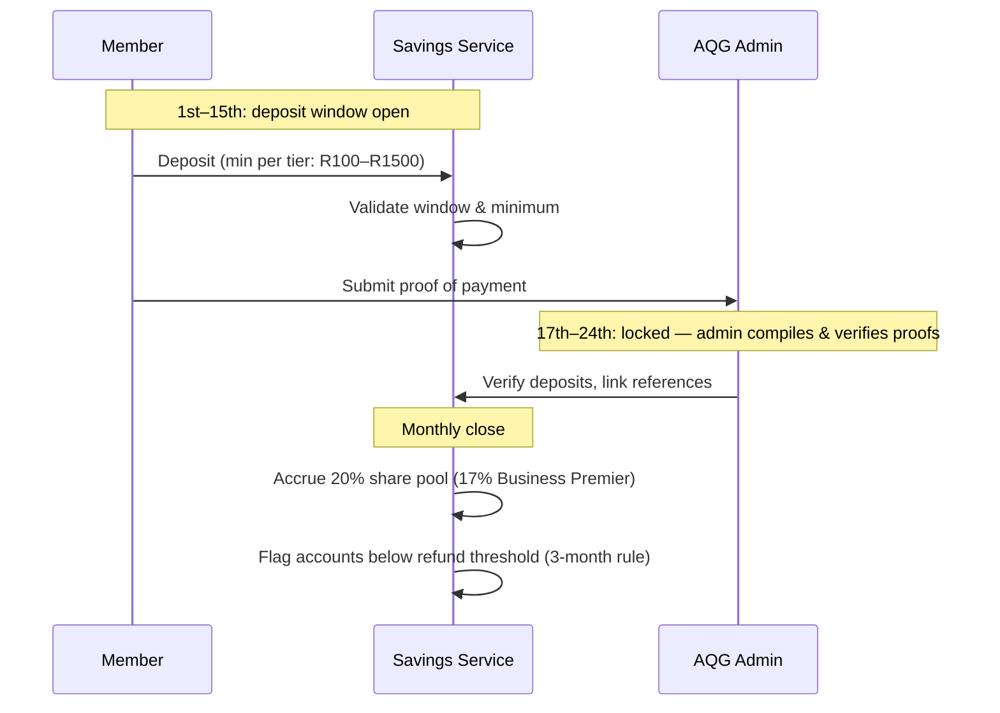
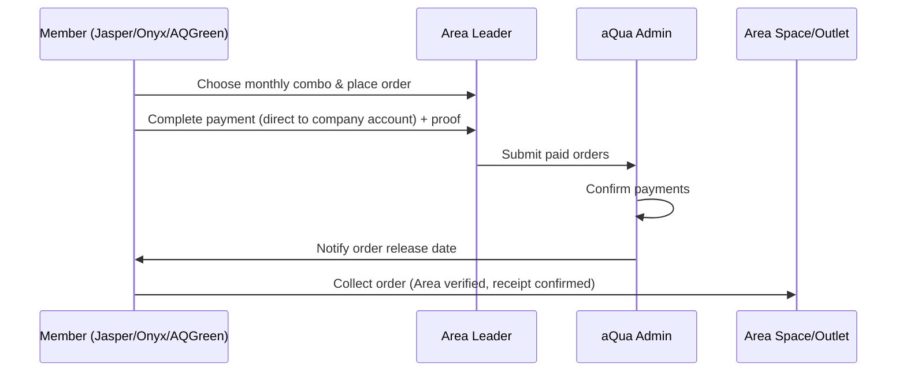
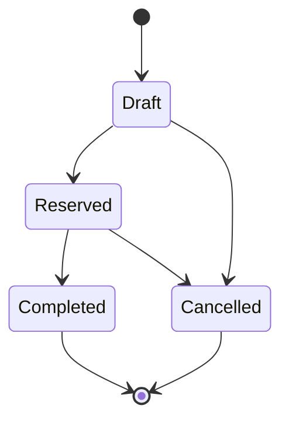
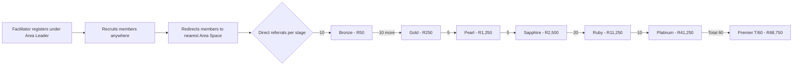
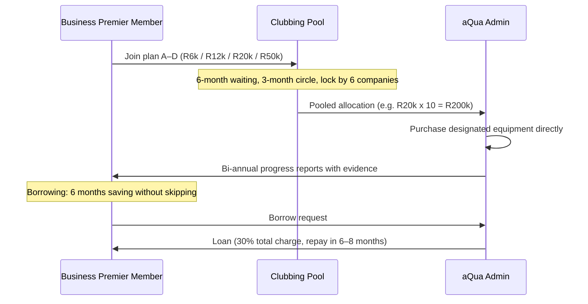

# Business Workflows: aQua Lifestyle Club Platform

Workflows marked **(existing)** are supported by the current codebase; those marked **(target)** come from the business documents and are not yet implemented.

## 1. Enquiry-to-Customer Conversion (existing)



## 2. Member Registration (target — online via ALC admin)



Registration requirements: ID number and copy, contact info + WhatsApp, bank confirmation letter (PDF), admin SMS acceptance. Registration payment must complete within 14 business days.

## 3. Monthly Savings Cycle (target — AQGreen)



Refund rule: savings below R1,500 (Standard) / R2,500 (Club Millionaire) / R4,500 (Business Premier) within 3 months → refund minus admin and branding costs. First-year payments locked 12 months; withdrawals in the first 6 months forfeit the 20% interest.

## 4. Monthly Order & Collection Cycle (target)



Order calendar:

| Opening | Cut-off | Delivery |
|---------|---------|----------|
| 1st | 5th | 10th |
| 6th | 10th | 15th |
| 11th | 16th | 25th |

Onyx level order sets: Level 0 → Combo 4 (pay 25th, collect 5th); Levels 1–3 → Combo 4 ×4 (pay 30th, collect 10th); Levels 4–5 → Combo 4 ×8 (pay 1st, collect 16th). Area changes require 42 hours before order release.

## 5. Order Intent Lifecycle (existing)



## 6. Area Leader License Application (target)

```mermaid
sequenceDiagram
    participant O as Onyx Member
    participant Admin as aQua Head Admin

    Note over O: Precondition: 20+ interested people in the area
    O->>Admin: Report of all area members (direct & indirect)
    O->>Admin: Submit profile photo, ID, address, social media, signed agreement
    O->>Admin: Purchase startup stock (20 full combos) + branding suit
    Admin->>Admin: Verify commitment, membership & referrals
    Note over Admin: 42 hours to review area; 4 consecutive presentations required
    Admin->>O: Approve license (Entre R750 / Area Independent Leader R2500)
    Note over O: ~30 days for profile to complete → Level 1 Area Leader
    Admin->>Admin: Host introduction event for approved Area Leader
```

Rank progression (order targets): Ruby 20 → Emerald 60 → Premier 100 → Dimond 200 → VIP 400 → Presidential 1200 → Chairman's circle 3600 → Ambassador 18,000. Cap: 300 Area Leaders.

## 7. Facilitator Referral & Ranking (target)



Awards are issued on completed direct referrals; incentives on completed indirect referrals. Facilitators must attend training workshops and may rate/report Area Leaders.

## 8. Business Premier Clubbing & Borrowing (target)



## 9. Profit Share Distribution (target)

Company retains 60% of project profits; 40% goes to the liquidity share pool, paid bi-quarterly and shared equally among participants. Example: R600,000 profit → R240,000 pool distributed equally.
