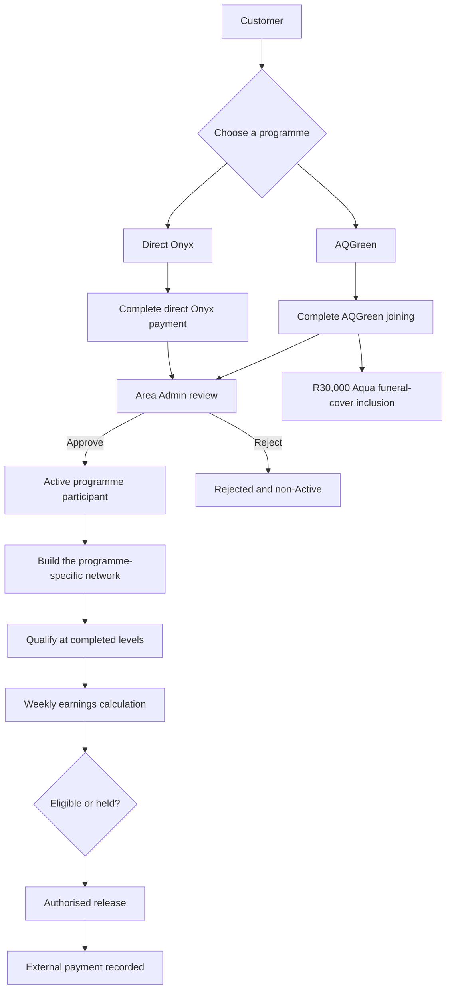
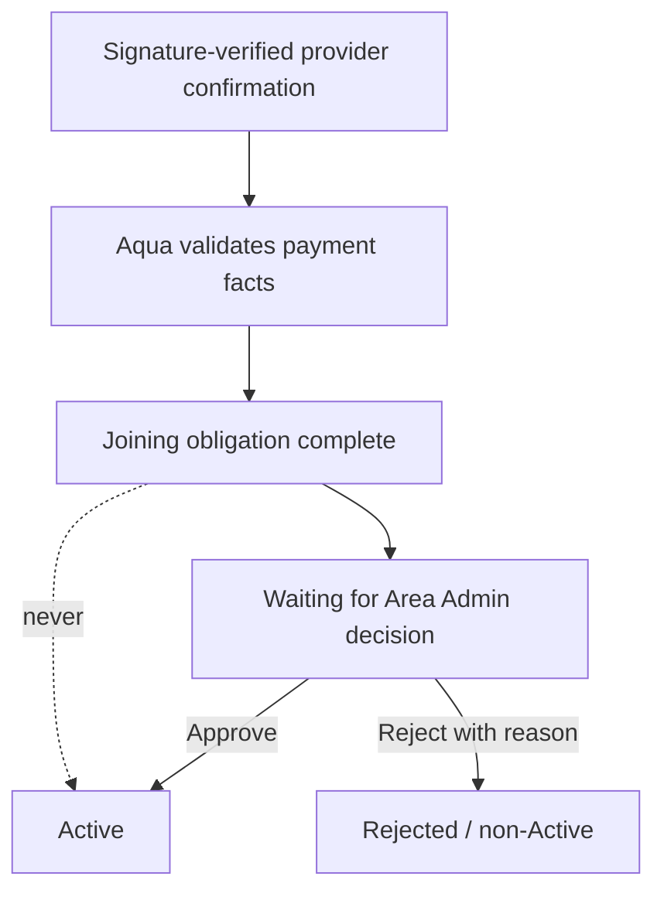
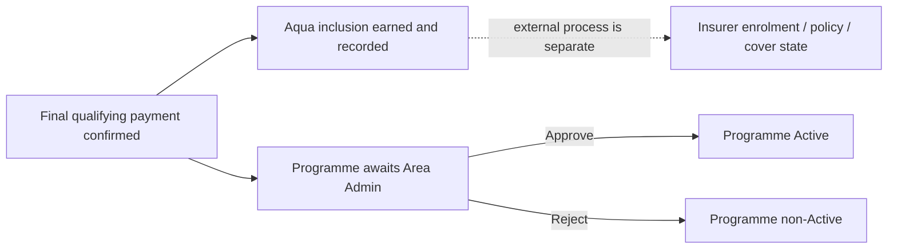

# Aqua Lifestyle Club: client system overview

This document tells the Aqua business story. Technical evidence and readiness detail live in the [verification register](07-verification-decision-and-risk-register.md).

## What Aqua is

Aqua combines programme membership, health and lifestyle benefits, a five-person recruitment network, and weekly earnings. The system keeps each step separate so that receiving money, approving participation, qualifying a network, calculating earnings, and paying earnings cannot be mistaken for one another.



## Who can join

A signed-in customer may start AQGreen or direct Onyx, independently or under an eligible recruiter who is already Active in the same programme. AQGreen and Onyx remain separate: participation and recruits in one never silently become participation or recruits in the other.

## AQGreen

### Joining obligation

`BUSINESS DECISION`

AQGreen joining totals **R1,200**. A customer may complete it in either of these ways:

- one confirmed R1,200 payment; or
- two distinct confirmed R600 joining instalments.

The customer selects the schedule before payment begins. Once a verified payment exists, the schedule cannot be changed or charged again after completion.

### Monthly subscription

AQGreen also has a separate **R600 recurring monthly obligation**. It is not another joining instalment, and the R1,200 joining amount must never be described as monthly.

The monthly model includes a seven-day grace period. Its due day is still a business decision, so automatic monthly creation remains off.

### Club Member savings are separate

Aqua also has a separate Club Member savings-account ledger. It must not be confused with AQGreen joining, the monthly programme obligation, or a particular member's loan. Account opening, provider-confirmed contributions, and maturity payout are not evidenced as production enabled; detailed current terms are in [document 02](02-business-rules-and-workflows.md).

## Direct Onyx

Direct Onyx joining requires the full confirmed **R6,120** direct-entry amount in one payment. Direct Onyx does not offer the AQGreen instalment schedule.

There is also a separate AQGreen-to-Onyx route requiring Active AQGreen participation, Level 2 qualification, an authorised loan, and a separate graduation decision. It creates a separate Onyx participation rather than rewriting AQGreen.

## What happens to a payment

Yoco confirms that a provider payment event occurred. Aqua decides what it means after validating the payment and its ownership.

The central rule is:

```text
Payment confirmation != programme approval
```

After the full AQGreen joining obligation is confirmed, the payment is complete but participation still waits for the responsible Area Administrator. Only an approval decision makes the participation Active. Rejection leaves it non-Active and the customer can see the recorded reason.



## Who approves participation

The responsible Area Administrator discovers pending work through an Area-scoped portal queue and count. Email may draw attention, but the durable portal queue is authoritative.

The administrator reviews the member and confirmed payment evidence, then approves or rejects. The server checks Area ownership and permission independently of the interface. Each participation can have only one authoritative, audited decision.

Approval may grant Member access. A fresh sign-in loads the new authority; the browser does not silently elevate a stale session.

## Funeral-cover inclusion

`BUSINESS DECISION`

Completing the AQGreen R1,200 joining obligation earns Aqua's **R30,000 funeral-cover inclusion**. The inclusion time is the confirmation time of the final qualifying payment:

- for R1,200 once: that payment's confirmation time;
- for R600 + R600: the later confirmation time.

Area Administrator approval is not the trigger. A later programme rejection does not silently delete an inclusion already earned through completed payment.



Aqua records its own inclusion entitlement. It does not claim insurer activation, policy, waiting-period, underwriting, claim, or cover facts that an authoritative external process has not supplied.

## Recruitment and levels

The network grows in groups of five. Both AQGreen and Onyx have five structural levels: 5, 25, 125, 625, and 3,125 qualifying people. A level is complete only when every required branch at that depth is complete; four direct recruits do not earn a partial Level 1.

AQGreen currently has authorised commission rates only for Levels 1–3; its Level 4 and Level 5 rates remain a business decision. The software evaluates AQGreen structure through Level 5 and records structural qualification separately from the currently commissioned depth. A structurally qualified Level 4 or Level 5 member therefore retains the authorised Level 1–3 components only; no Level 4/5 component exists. Onyx evaluates and has confirmed rates through Level 5. Only Active participation in the same programme contributes, and a payout hold does not remove network placement.

## How weekly earnings work

The business flow is:

```text
network at the historical cutoff
        -> completed qualification level
        -> weekly calculation using the terms for that week
        -> Earned, Held, or Not earned
        -> authorised release
        -> external payment and reference recorded
```

The weekly cycle is Friday through Thursday in Johannesburg time. A closed week uses the network and terms that applied then, not today's state.

AQGreen and Onyx use different level rates. The exact amounts and qualification rules are specified in [document 02](02-business-rules-and-workflows.md).

## What can stop payment of earnings

An overdue own AQGreen monthly obligation or applicable Onyx loan repayment can hold that member's AQGreen payout at the weekly cutoff. The current rule preserves network placement and does not infer an upline penalty.

Calculation, release, and payment are separate. Automation calculates only; authorised actions release an eligible record and record a transfer completed outside Aqua.

## What is automated, and what is enabled

`VERIFIED IMPLEMENTATION`

- Payment confirmation, durable approval queues, approval/rejection, notification outbox records, member progress views, commission calculations, and monthly-obligation scheduling logic are implemented and merged.
- The latest repository CI passed at the documented baseline.

`PLANNED / NOT ENABLED`

- The weekly calculation worker defaults to disabled. Its intended first automatic cycle is 14–20 August 2026; earlier weeks are not automatically backfilled.
- The monthly-obligation worker defaults to disabled. September 2026 is the intended first automatic month, but no due day may be created until Aqua authorises it.
- Real production Yoco finality and external Bird delivery require separate acceptance evidence.

Repository defaults are not proof of current production settings. Production deployment and the AQGreen migration incident are under active investigation; see [documents 06](06-operations-and-enablement-runbook.md) and [07](07-verification-decision-and-risk-register.md).

## Decisions we still need from Aqua

These are business questions, not a technical backlog:

1. **What are the AQGreen Level 4 and Level 5 per-person commission rates?** The structural levels exist, but no amounts may be invented; current authorised commission components end at Level 3.
2. **Which day of each month is the R600 AQGreen obligation due?** The answer must be a day from 1 to 28 and must define the first authorised month.
3. **Does an overdue AQGreen member affect an upline's structural qualification or only that member's own payout?** The current safe rule holds only the member's payout.
4. **What insurer process turns Aqua's funeral-cover inclusion into external cover?** Aqua must confirm enrolment authority, any six-month waiting-period meaning, effective dates, and which evidence the system may display.
5. **What should refunds, disputes, or chargebacks do to participation, funeral inclusion, network qualification, and already-calculated earnings?** Historical ledgers must not be rewritten without an authorised policy.
6. **What evidence and authority are acceptable for importing legitimate legacy members who have no modern Aqua payment history?** The import must record real historical facts, not fabricate modern payments.
7. **What resolution decisions may authorised operators make when financial records are marked `ReconciliationRequired`?** The allowed outcomes and evidence standard must be decided before a mutation workflow is built.
