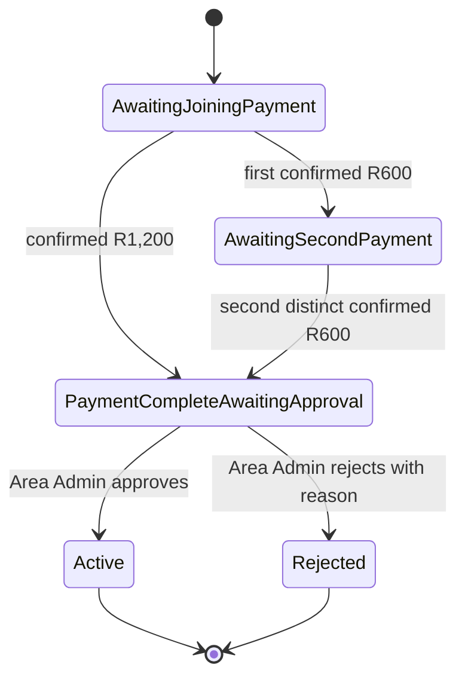
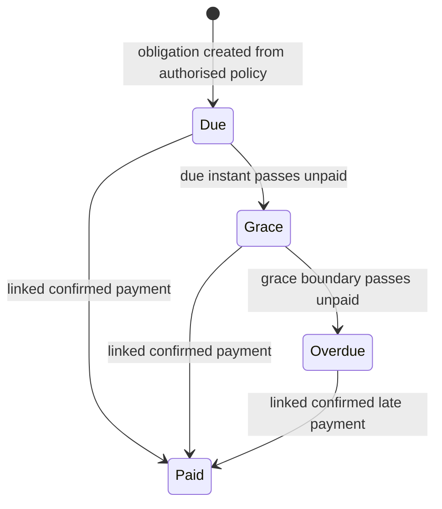
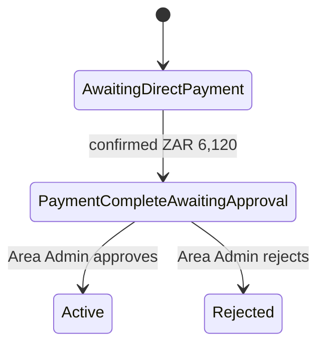
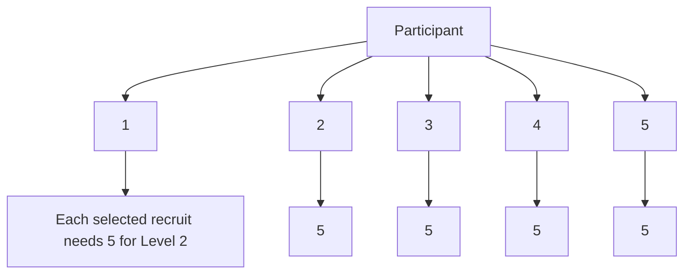
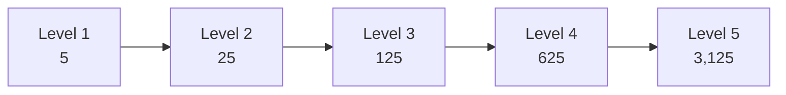
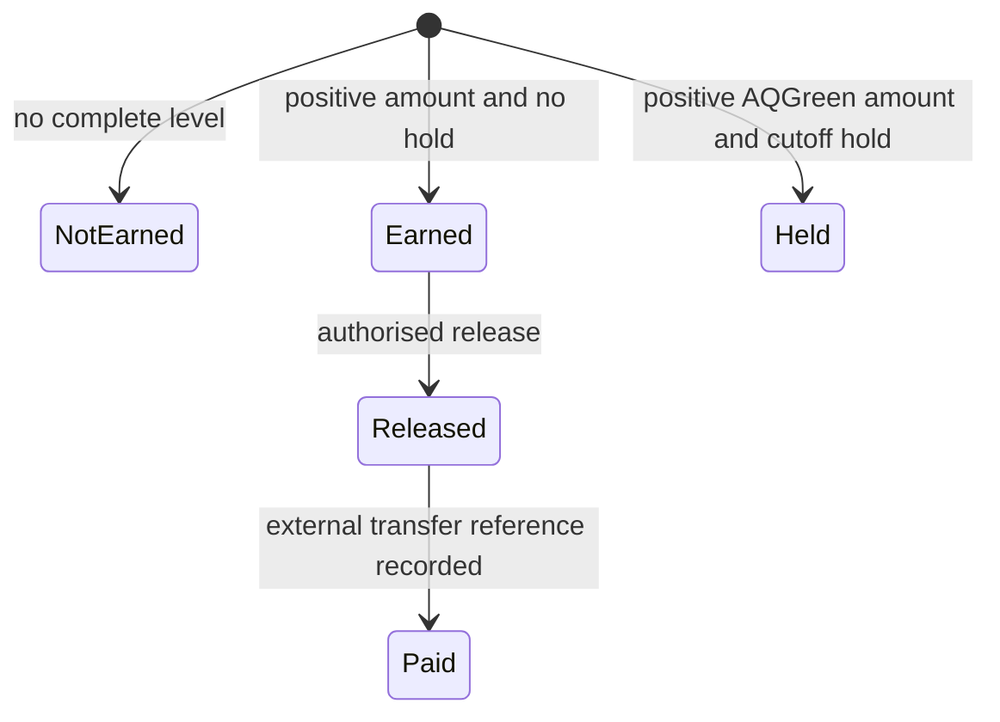
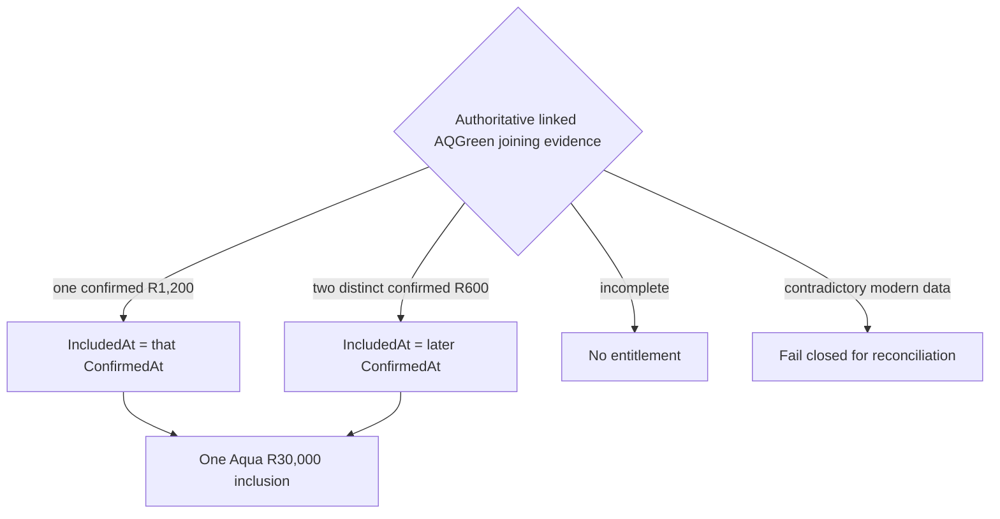
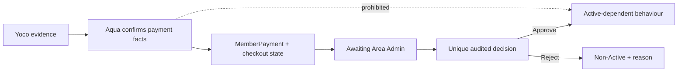

# Aqua business rules and workflows

This is the precise business specification for the currently confirmed Aqua programme rules. Implementation and evidence status are recorded separately in [document 07](07-verification-decision-and-risk-register.md).

## 1. Relationship and programme boundaries

| Rule | Classification |
| --- | --- |
| A registered customer may have an AQGreen participation, an Onyx participation, both, or neither. | `BUSINESS DECISION` |
| AQGreen and Onyx are separate programmes with separate participation, recruitment, payment, and commission records. | `BUSINESS DECISION` |
| A recruiter must have Active participation in the same programme. No recruiter means an independent network root. | `VERIFIED IMPLEMENTATION` |
| Payment-confirmed but unapproved participation is not Active and does not qualify for Active-only network or finance behaviour. | `VERIFIED IMPLEMENTATION` |
| `Entry` is a retained technical/database name for AQGreen; it is not a third customer programme. | `SUPERSEDED` terminology boundary |
| `Business Premier` is legacy catalogue/demo terminology and must not be used as the name of Onyx. | `SUPERSEDED` |

## 2. AQGreen joining

### 2.1 Obligation and schedules

- Total joining obligation: **ZAR 1,200**.
- Supported schedule A: one **ZAR 1,200** payment.
- Supported schedule B: two distinct **ZAR 600** AQGreen joining payments.
- The schedule is selected before the first checkout and is locked once a verified payment is recorded.
- A payment must be confirmed, match the customer and Area, have AQGreen joining purpose, use ZAR, and match the expected amount.
- The same payment identifier cannot satisfy both instalment slots.
- Current status or aggregate amount is not a substitute for the linked payment evidence.
- Once the obligation is complete, another joining checkout is not required or permitted.

### 2.2 Lifecycle

The final payment simultaneously proves the joining obligation complete and earns Aqua's funeral-cover inclusion. It does **not** make participation Active.

### 2.3 Approval and rejection

- The responsible Area Administrator must discover the item in the durable Area-scoped queue.
- Approval and rejection require the dedicated backend permission and correct Area scope.
- Approval records a unique append-only decision, sets `ActivatedAt` to the decision time, and changes status to Active.
- Rejection records a unique append-only decision and the required reason; it changes status to Rejected and never sets `ActivatedAt`.
- A repeated identical decision is idempotent. A conflicting second decision is rejected.
- Approval may promote a Guest identity to Member and changes the security stamp; a fresh session is required for the new authority.
- Rejection does not remove a funeral-cover inclusion already earned by payment.

## 3. AQGreen monthly subscription

The **ZAR 600 monthly obligation** is separate from joining.

| Concern | Rule |
| --- | --- |
| Creation | Only Active AQGreen participation can receive an obligation. |
| Due date | `UNRESOLVED`: Aqua has not selected the day of month. The durable policy accepts only days 1–28. |
| First intended automatic month | September 2026, subject to an authorised due policy and enablement gates. |
| Grace | Seven days after the due instant. |
| States | Due, Grace period, Overdue, Paid. |
| Payment | Only a confirmed ZAR 600 monthly-purpose payment linked to that specific obligation settles it. |
| Overdue consequence | The member's own AQGreen payout is held for a cycle where the obligation was overdue at the cutoff. |
| Late cure | Payment settles the debt and can restore future eligibility; it does not rewrite a closed cycle. |
| Network | Placement remains; the upline effect is `UNRESOLVED`, so none is inferred. |

## 4. Onyx

Before Onyx rules, preserve one adjacent financial boundary: Club Member savings are a separate account/ledger from AQGreen joining, AQGreen monthly obligations, and an individual Onyx loan. Current savings terms encode a R100 minimum confirmed contribution during days 1–15, 20% per-contribution maturity interest, and 12-month account maturity. Pooled-fund business use does not transfer ownership of a named member contribution to a named borrower. Full opening, provider contribution, and maturity-payout operations are not part of the programme joining workflow.

### 4.1 Direct joining

- Direct entry amount: **ZAR 6,120** under the current terms.
- The full amount is required in one confirmed direct-Onyx payment; no instalment schedule is defined.
- Provider confirmation leads to payment-complete/awaiting-Area-approval, not Active.
- The Area Administrator must approve or reject using the same separation and audit principles as AQGreen.

### 4.2 AQGreen-funded Onyx path

This is not direct Onyx joining.

- The AQGreen participant must be Active and currently qualify at Level 2.
- The current model uses an Onyx loan principal of ZAR 6,120, 30% charge, ZAR 7,956 total payable, and a three-month repayment period.
- The member accepts the agreement before an administrator approves it.
- Approval of the loan starts its effective date and creates four initial weekly ZAR 200 requirements.
- A separate authorised graduation decision revalidates eligibility and creates a separate Active Onyx participation.
- AQGreen participation, its network, loan debt, and Onyx participation remain separate records.
- `VERIFIED IMPLEMENTATION`: domain/persistence rules and secured read views exist.
- `PLANNED / NOT ENABLED`: the complete production loan-offer, provider repayment, graduation, and operational journey is not evidenced as enabled.

### 4.3 Onyx travel benefit

Current encoded terms require complete Onyx Level 3, a three-month wait from the qualifying closed-cycle cutoff, and a 10% member trip contribution. Eligibility and availability are separate. Trip selection, pricing, booking, fulfilment, and payment are not implemented.

The travel synchronizer is coupled operationally to the weekly worker, which defaults to disabled. Missing historical cycles and unresolved historical terms/Area evidence prevent invented backfill.

## 5. Recruitment and qualification

### 5.1 Structural rules

- Only Active participation in the same programme contributes.
- A complete branch size is exactly five selected participants at each recruiter node.
- If more than five are placed under a recruiter, the deterministic earliest five by effective placement/activation and participation identifier form the selected branch for the cutoff.
- Every branch at a depth must be complete. There is no partial level.
- Recruiter corrections are effective-dated and must form a valid, non-cyclic history. Ambiguous, discontinuous, dangling, or deleted evidence fails closed for historical calculation.

### 5.2 Programme depth

| Programme | Structural levels | Population at the level |
| --- | ---: | --- |
| AQGreen | 1–5 | 5, 25, 125, 625, 3,125 |
| Onyx | 1–5 | 5, 25, 125, 625, 3,125 |

The full five-level structure contains 3,906 participants including the root.

`BUSINESS DECISION`: AQGreen structurally continues through Levels 4 and 5 even though its currently authorised commission rates end at Level 3.

`VERIFIED IMPLEMENTATION`: the AQGreen network enum and evaluator model structural Levels 1–5. Structural qualification and authorised commission depth are separate: current AQGreen terms still contain components only for Levels 1–3.

## 6. Commission rules

### 6.1 Cycle and terms

- Cycle: Friday 00:00 through Thursday 23:59:59.999... in `Africa/Johannesburg`.
- A cycle is calculated only after it closes.
- Network, participation, Area, obligation, and loan state are evaluated as of the cycle cutoff, not from mutable current state.
- Commission terms are immutable, effective-dated versions selected for the cycle. No current-terms fallback may calculate an old cycle.
- Initial automated/effective-dated terms boundary: **14 August 2026 00:00 Johannesburg**.
- Initial version identifiers: `2026-08-14-entry-initial` and `2026-08-14-onyx-initial`.

The underlying commission model is a business rule that existed independently of this automation date. The 14 August boundary is the programme engine's first authorised effective-dated terms boundary; it is not necessarily the date when Aqua originally created the commission model.

### 6.2 AQGreen rates and derived components

| Level | Network | Rate/person | Level component | Cumulative weekly from authorised components |
| --- | ---: | ---: | ---: | ---: |
| Level 1 | 5 | ZAR 30 | ZAR 150 | ZAR 150 |
| Level 2 | 25 | ZAR 10 | ZAR 250 | ZAR 400 |
| Level 3 | 125 | ZAR 10 | ZAR 1,250 | ZAR 1,650 |
| Level 4 | 625 | `UNRESOLVED` | `UNRESOLVED` | ZAR 1,650 from authorised Levels 1–3 only |
| Level 5 | 3,125 | `UNRESOLVED` | `UNRESOLVED` | ZAR 1,650 from authorised Levels 1–3 only |

The Level 4 and Level 5 rows do **not** mean those levels pay ZAR 1,650. They mean the only currently authorised components remain Level 1 through Level 3; no Level 4 or Level 5 amount may be calculated until Aqua authorises an effective-dated rate.

The current implementation stores the three derived component amounts—ZAR 150, ZAR 250, and ZAR 1,250—and evaluates AQGreen structure through Level 5. Structurally qualified Levels 4–5 retain only those authorised Level 1–3 components, for a cumulative ZAR 1,650; no Level 4/5 component is created. Incomplete structural levels have no partial component.

### 6.3 Onyx rates

| Completed level | Required population at level | Per-person rate | Level component |
| --- | ---: | ---: | ---: |
| Level 1 | 5 | ZAR 50 | ZAR 250 |
| Level 2 | 25 | ZAR 20 | ZAR 500 |
| Level 3 | 125 | ZAR 12.62 | ZAR 1,577.50 |
| Level 4 | 625 | ZAR 5 | ZAR 3,125 |
| Level 5 | 3,125 | ZAR 4 | ZAR 12,500 |

The complete cumulative Level 1–5 total is ZAR 17,952.50. No Onyx hold rule is inferred from AQGreen obligations.

### 6.4 Payout lifecycle and holds

- Calculation never sends money.
- An overdue own AQGreen monthly obligation or applicable Onyx loan can hold that participant's AQGreen payout as of the cutoff.
- A post-cutoff payment cannot change an old cycle from Held to Earned.
- Release and recording external payment are separately permissioned, audited, idempotent actions.
- `PaidAt` is Aqua's recording time for an asserted external transfer, not independently verified bank/provider occurrence unless future evidence is added.

## 7. Funeral-cover inclusion

`BUSINESS DECISION`

The R30,000 Aqua inclusion is earned when authoritative linked payments prove the AQGreen ZAR 1,200 joining obligation complete.

- Approval and Active status are not qualification evidence.
- Programme rejection does not erase the inclusion.
- One participation has at most one entitlement.
- The 26 July 2026 lower bound identifies the supported modern application joining model. It is not a funeral-cover promise inception, software deployment, insurer activation, or external cover date.
- Existing legitimate members absent from the modern participation/payment history require a future audited legacy import; fake payment rows are prohibited.
- External insurer enrolment, policy number, waiting-period state, cover commencement, underwriting, and claims eligibility are outside the current entitlement record and remain `UNRESOLVED` where business/provider rules are absent.

## 8. Payment versus approval boundary

Email is supplemental. The durable portal queue and participation state are authoritative.

## 9. Unresolved business rules

| Decision | Current fail-closed behaviour |
| --- | --- |
| AQGreen Level 4 and Level 5 per-person commission rates | Structure is confirmed through Level 5, but no Level 4/5 value, zero rate, or extrapolation is invented; current authorised components end at Level 3. |
| AQGreen monthly due day and first authorised due policy | No due-policy row is invented; monthly worker remains disabled. |
| Effect of an overdue member on uplines | Only the member's own payout is held; network placement remains. |
| External funeral-cover enrolment, waiting period, and cover dates | Aqua records inclusion only. |
| Refund/dispute/chargeback effects | No participation or historical ledger reversal is invented. |
| Legacy-member import evidence and authority | No placeholders or fake modern payments. |
| Authorised outcomes for `ReconciliationRequired` financial records | Discovery remains read-only; no arbitrary financial mutation. |
