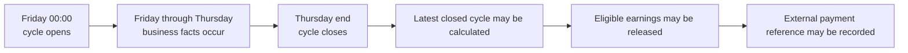
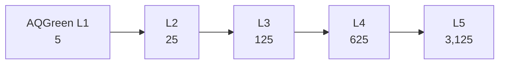
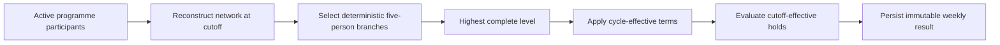
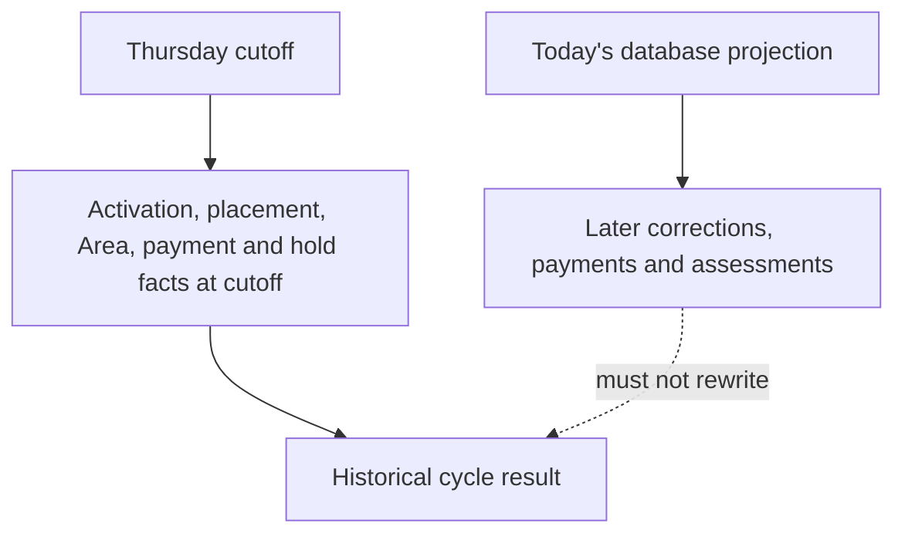
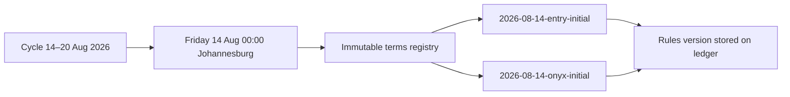
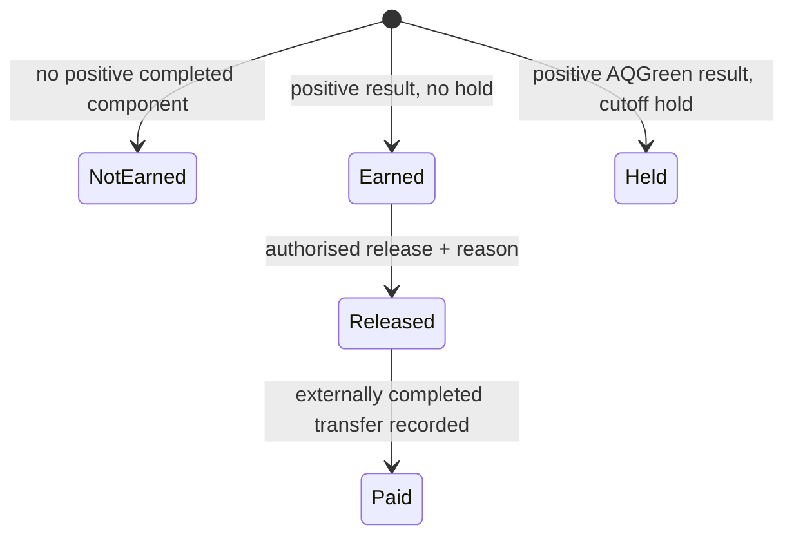

# The Aqua commission engine, explained

Commission is not simply `number of recruits × amount`. The result depends on the programme structure at a historical cutoff, the terms authorised for that week, Area state, member-specific holds, prior calculation records, and separate release/payment decisions.

The exact rates and qualification rules are in [document 02](02-business-rules-and-workflows.md). This document explains why the engine is strict.

## 1. The weekly cycle

The authoritative cycle runs in `Africa/Johannesburg` time:



The worker wakes periodically, resolves the latest fully closed Friday-to-Thursday week, and calculates at most that latest week. It does not automatically backfill arbitrary older weeks.

## 2. Structure before money

Only Active participants in the same programme form the qualifying network. Each selected branch needs five people at every required depth.

Both AQGreen and Onyx have five structural levels. Each level requires five complete branches at every depth: 5, 25, 125, 625, and 3,125 people at Levels 1–5. An incomplete branch gives no partial level component.



`VERIFIED IMPLEMENTATION`: the AQGreen evaluator and level enum represent structural Levels 1–5. The commission terms remain intentionally limited to the currently authorised Level 1–3 components. Onyx also evaluates through Level 5.



## 3. Current state is not historical state

Suppose a recruiter is corrected after a week closes. Today's network may be valid, but it is not the network that existed for that old week. Likewise, a monthly obligation paid today may have been overdue at last Thursday's cutoff.



The implementation therefore uses:

- `ActivatedAt` to decide whether participation existed at the cutoff;
- effective-dated recruiter-correction history to rebuild placement;
- append-only Area activation state where evidence exists;
- monthly due, grace, and payment timestamps rather than the current obligation enum;
- loan effective, due, repayment, and deadline facts rather than the current loan projection.

Ambiguous, discontinuous, cyclic, dangling, or deleted evidence fails closed. The engine does not replace missing history with today's state.

## 4. Current terms are not historical terms

Rates can change. Recalculating an old week with a newly deployed constant would silently alter financial history.

Commission terms are therefore immutable, effective-dated database rows. A resolver selects the latest authorised row at or before the relevant canonical Friday boundary and fails if no unambiguous row exists.



`BUSINESS DECISION`: the initial automated commission terms become effective from **14 August 2026 00:00 Johannesburg**. This is the programme engine's first authorised effective-dated terms boundary; it is not necessarily the date when the underlying business commission model was created.

Both programmes use per-person commission models, with different rate schedules:

| Level | AQGreen rate/person | Onyx rate/person |
| --- | ---: | ---: |
| Level 1 | R30 | R50 |
| Level 2 | R10 | R20 |
| Level 3 | R10 | R12.62 |
| Level 4 | `UNRESOLVED` | R5 |
| Level 5 | `UNRESOLVED` | R4 |

For AQGreen, the confirmed rates derive the implemented components exactly: 5 × R30 = R150; 25 × R10 = R250; and 125 × R10 = R1,250. Their cumulative weekly amount is R1,650. This is only the sum of authorised Levels 1–3; it is not a Level 4 or Level 5 rate or eventual total.

`VERIFIED IMPLEMENTATION`: the bootstrap is idempotent and conflict-checked; it does not enable a worker. Repository presence does not prove those rows exist in production.

## 5. Qualification, payable level, and holds

Structural qualification, authorised commission depth, and payout status answer different questions:

- **Business structural level**: how much of the five-level network was complete at cutoff?
- **Authorised commission depth**: which level rates are known and effective for the cycle?
- **Calculated amount**: which complete level components apply under the terms?
- **Payout status**: is that amount Earned, Held, Released, or Paid?

The current AQGreen engine records structural qualification through Level 5 independently from commissioned depth. Under current terms, structurally qualified Levels 4–5 receive the known Level 1–3 components only, while their highest commissioned level remains Level 3. No zero, guessed, or inherited Level 4/5 component is recorded. Future Level 4/5 rates must be explicitly authorised and effective-dated so they cannot rewrite old periods.

For AQGreen, an own monthly obligation or applicable Onyx loan can hold the member's payout when it was overdue at cutoff. A later cure affects future eligibility but not the closed week. The current implementation does not remove network placement and does not infer an upline penalty.

Onyx currently has no corresponding hold rule. No AQGreen hold is imported into Onyx without a confirmed business decision.

## 6. Determinism

A deterministic cycle gives the same output from the same authorised inputs:

```text
same cutoff
+ same effective network
+ same Area evidence
+ same effective terms
+ same cutoff financial standing
= same calculation
```

Determinism matters for audit, support, retry, and recovery. A changed result on replay must mean that source evidence or the algorithm changed—not that the clock advanced.

Some inputs remain insufficient for arbitrary historical reconstruction, including pre-baseline Area state, provider finality for old obligations, ambiguous legacy allocation times, and refund/chargeback policy. Those cases require reconciliation rather than a convenient calculation.

## 7. Idempotency

Calculation first checks whether the programme/Area/cycle period already exists. Database uniqueness also prevents a second period and duplicate participation ledger rows.

```mermaid
sequenceDiagram
    participant W1 as Worker/request 1
    participant DB as PostgreSQL
    participant W2 as Worker/request 2
    W1->>DB: acquire transaction-scoped calculation lock
    W2->>DB: wait for same lock
    W1->>DB: create period + commission rows
    W1->>DB: commit
    W2->>DB: inspect existing period
    DB-->>W2: already calculated; create 0 rows
```

Application idempotency and database uniqueness are complementary. Neither is removed because the other exists.

## 8. Locking and concurrency

Two processes may wake at the same time or an operator may calculate while a worker runs. A transaction-scoped advisory lock serialises the shared calculation critical section across application instances. Unique indexes remain the final duplicate guard.

Locking only controls concurrent writers. It does not make missing historical input authoritative; unresolved evidence still fails closed.

## 9. Ledger and payout lifecycle



The current application releases only eligible Earned records. It does not send a transfer. Recording `Paid` requires an external reference and asserts that an outside transfer was completed; Aqua does not currently verify that transfer with a payout provider.

An old period and its components are historical ledger facts. Soft deletion is not an authorised recalculation, reversal, or correction mechanism.

## 10. Worker state and automatic cutover

```text
commission engine implemented
!=
automatic worker enabled
```

`PLANNED / NOT ENABLED` at this repository baseline:

- `App:WeeklyCommissions:Enabled` defaults to `false`.
- The intended first automatic cycle is Friday 14 August through Thursday 20 August 2026.
- Earlier cycles are not automatically backfilled.
- Each Area needs authorised historical baseline evidence.
- Initial terms rows must be bootstrapped and checked.
- PostgreSQL application-path idempotency, production E2E, missed-cycle recovery, topology, observability, and controlled enablement remain tracked gates.

The operational sequence is in [document 06](06-operations-and-enablement-runbook.md). Current issues and evidence are in [document 07](07-verification-decision-and-risk-register.md).

## 11. Why strict failure is safer

A missing result can be investigated. A plausible but historically false financial result can be paid and become difficult to reverse.

The engine therefore prefers:

- an explicit unresolved result over current-state guessing;
- immutable terms over deploy-time constants for old weeks;
- append-only evidence over silent row rewriting;
- a unique ledger over duplicate “retry” rows;
- an authorised reconciliation decision over direct SQL correction.
