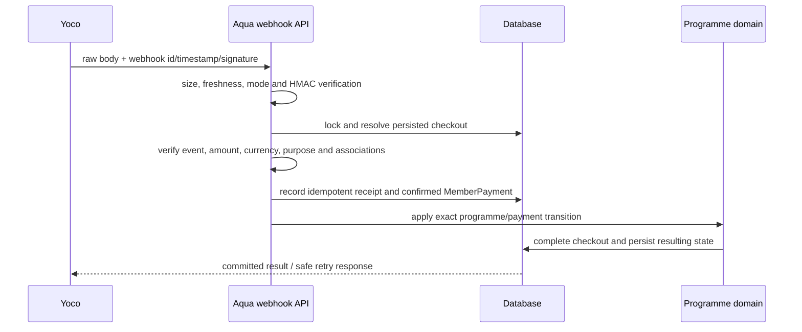
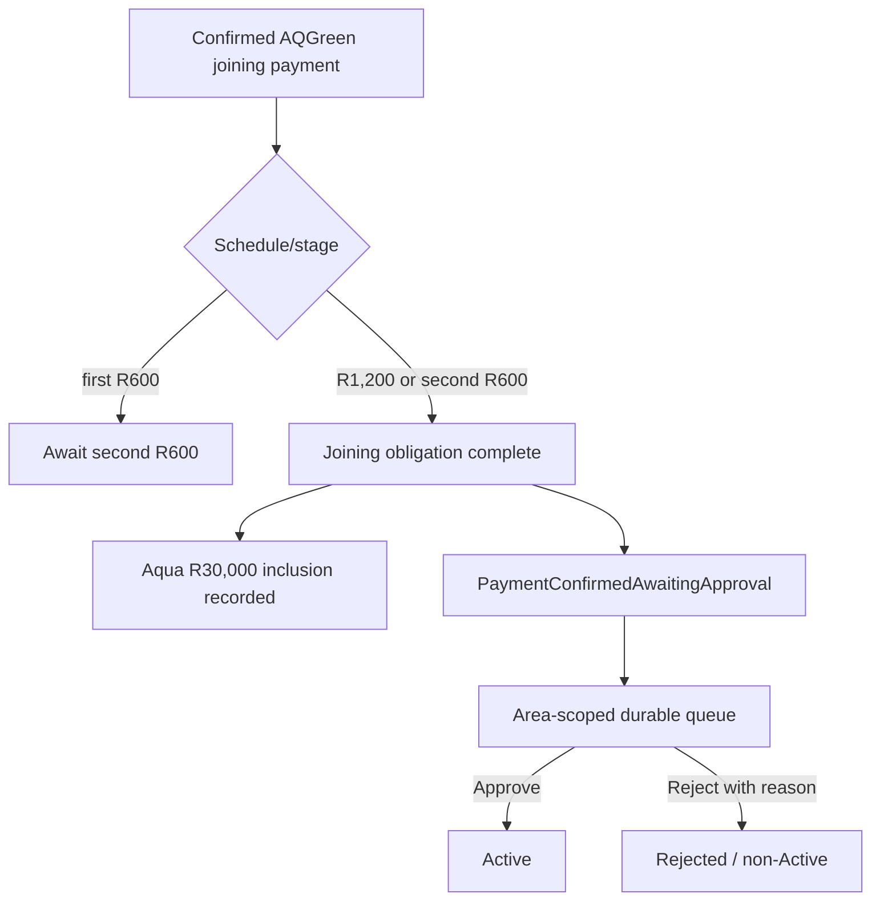

# Payments, Area approval, and Yoco

The payment architecture has two independent boundaries:

```text
Yoco confirms that a provider payment event occurred.
Aqua decides what that event means.

Payment confirmation != programme approval.
```

See [document 02](02-business-rules-and-workflows.md) for the exact programme rules and [document 06](06-operations-and-enablement-runbook.md) for controlled acceptance.

## 1. Checkout creation

### AQGreen joining

The customer selects either:

- full: one R1,200 checkout; or
- two instalments: the next R600 checkout, followed by a second distinct R600 checkout after the first is confirmed.

A persisted `AQGreenJoiningCheckout` carries the participation, schedule, stage, amount, currency, Area, and stable identifiers before Yoco is called. An active checkout locks the chosen schedule. A completed obligation cannot open another joining checkout.

### Direct Onyx

Direct Onyx uses a separate `DirectOnyxCheckoutIntent` and requires the full R6,120 amount. It never borrows AQGreen instalment semantics. The separate AQGreen-funded Onyx loan/graduation route does not use the direct-entry checkout.

### AQGreen monthly obligation

A monthly checkout must identify one specific server-authoritative obligation and period. A confirmed monthly payment is not allocated to “the oldest open” obligation by guess. Contradictory linkage is marked for reconciliation.

## 2. Hosted checkout boundary

Checkout creation occurs through a server-side Yoco adapter. Secret keys never go to the frontend. The customer receives only the hosted checkout URL.

A browser return—success, cancel, or failure—is informational. It cannot confirm a payment, advance an instalment, activate participation, settle a monthly obligation, release commission, or create an entitlement.

## 3. Signed webhook processing



Before business state changes, Aqua verifies at least:

- raw-body signature and timestamp freshness;
- deployment mode and test/live separation;
- successful provider event type/status;
- provider checkout and payment identifiers;
- merchant checkout reference;
- exact amount and ZAR currency;
- payment purpose;
- customer, participation, obligation, and Area ownership;
- whether the provider event or payment already exists;
- whether a replay conflicts with previously stored facts.

The receipt retains the identifiers and payload hash needed for idempotency/conflict detection without exposing raw sensitive content. Checkout locks, receipt/payment uniqueness, and domain idempotency protect duplicate delivery. A duplicate with the same facts reuses the committed result; a conflicting replay fails.

`INTEGRATED`, but not `PRODUCTION VERIFIED`: repository tests exercise signatures and payment processing. Real Yoco checkout/webhook delivery, provider occurrence semantics, retry signing, settlement, refund, dispute, and chargeback behaviour still require provider acceptance evidence.

## 4. AQGreen payment outcome



The final qualifying `MemberPayment.ConfirmedAt` is the funeral inclusion time. Approval time and activation time are not substitutes.

## 5. Area Administrator approval

The portal exposes:

- an Area-scoped pending summary and navigation badge;
- an awaiting-only queue;
- member/participation details;
- confirmed payment description, amount, reference, and confirmation time;
- explicit Approve and Reject actions.

Backend enforcement includes:

- dedicated view/approval permissions;
- Area scope from the authenticated tenant/host authority, not a trusted client ID;
- independent Area checks on queue, approve, and reject paths;
- a transaction-owned per-participation decision lock;
- a unique decision constraint;
- append-only approval/rejection records;
- idempotent matching repeats and rejection of conflicting outcomes.

The responsible Area Administrator can act. A different Area Administrator cannot discover or mutate the participation through direct API access.

## 6. Notifications and durable work

The payment transaction schedules protected, deterministic outbox messages for the customer and authorised Area Administrators. The decision transaction schedules the customer outcome message.

Email is an attention mechanism. The participation state and portal queue are authoritative. Missing, delayed, disabled, or failed Bird delivery must not lose the approval task or block the decision.

The outbox provides durable intent, database uniqueness, retry/claim recovery, and a Bird idempotency header. Bird accepting a request is not proof that the recipient received it; delivery/bounce webhooks are not currently retained.

## 7. Approval outcome and authentication

Approval sets the participation Active and may promote an eligible Guest identity to Member. The security stamp changes, invalidating the old JWT/session. The customer signs in again and receives current Member permissions. This is an intentional security transition, not a browser redirect loop.

Rejection leaves the user non-Active and preserves the payment and Aqua inclusion facts. The customer projection returns the decision timestamp and persisted rejection reason.

## 8. Historical activation defect

`HISTORICAL`

Earlier behaviour allowed confirmed programme payment to flow too close to activation and older documentation described successful payment as activating AQGreen or Onyx. That violated the intended Area decision boundary.

`SUPERSEDED` by the merged rule:

```text
verified payment -> PaymentConfirmedAwaitingApproval -> unique Area Admin decision
```

Current domain code has no payment callback, webhook, worker, reconciliation query, or frontend refresh path that is authorised to set an AQGreen/direct-Onyx participation Active. Existing historical records must not be declared wrong solely because they are Active; payment, participation, decision, tenant, and migration evidence must be inspected before any reconciliation conclusion.

## 9. Frontend compatibility protection

The health contract advertises a payment contract version and explicit capabilities. The current frontend requires:

- `aqua-payments-2026-08-09-flexible-payment-approval`;
- `aqgreen-flexible-joining-v1`;
- `programme-approval-queue-v1`;
- `direct-onyx-checkout-v1`.

If the frontend cannot prove that the deployed API understands those semantics, it disables payment actions and reports an operational incompatibility. Accepting money against an unknown contract is less safe than refusing checkout until API/frontend deployment alignment is restored.

## 10. Current P0001 production-reconciliation incident

`ACTIVE WORKSTREAM — NOT YET AUTHORITATIVE`

The funeral-cover migration contains a PostgreSQL fail-closed guard that raises `P0001` when modern AQGreen participation/payment facts contradict the model needed for deterministic backfill. A separate active workstream is inventorying the production contradiction before proposing remediation.

At this documentation baseline:

- the migration guard is merged;
- no production row classification or remediation outcome is merged into `main`;
- an unmerged read-only inventory exists on `fix/production-aqgreen-deployment-reconciliation` at commit `2033592`;
- the inventory is evidence-gathering only and does not prove production counts or authorise mutation;
- this pack does not claim the incident is resolved, the migration is deployed, or payment acceptance is production verified.

The migration and historical boundary are explained in [document 05](05-data-history-migrations-and-legacy-members.md).

## 11. Payment limitations that remain

- Real Yoco production finality and webhook acceptance: open external gate.
- Provider settlement into Aqua's bank account: not represented.
- Refund, dispute, and chargeback state/policy: unresolved.
- Full durable inbox/failure history and provider reconciliation: incomplete.
- Manual resolution of `ReconciliationRequired` rows: discovery exists; authorised mutation workflow does not.
- Actual Bird delivery, bounce, and rejection evidence: external acceptance not established.
