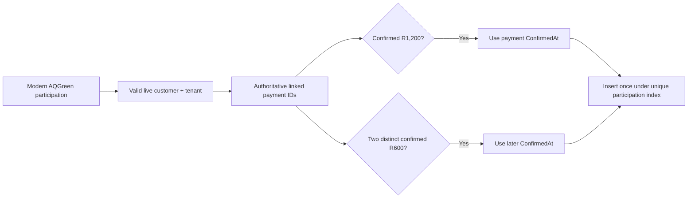
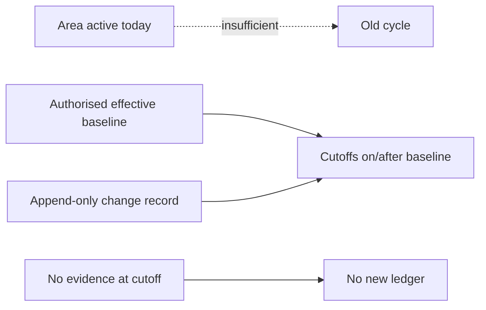
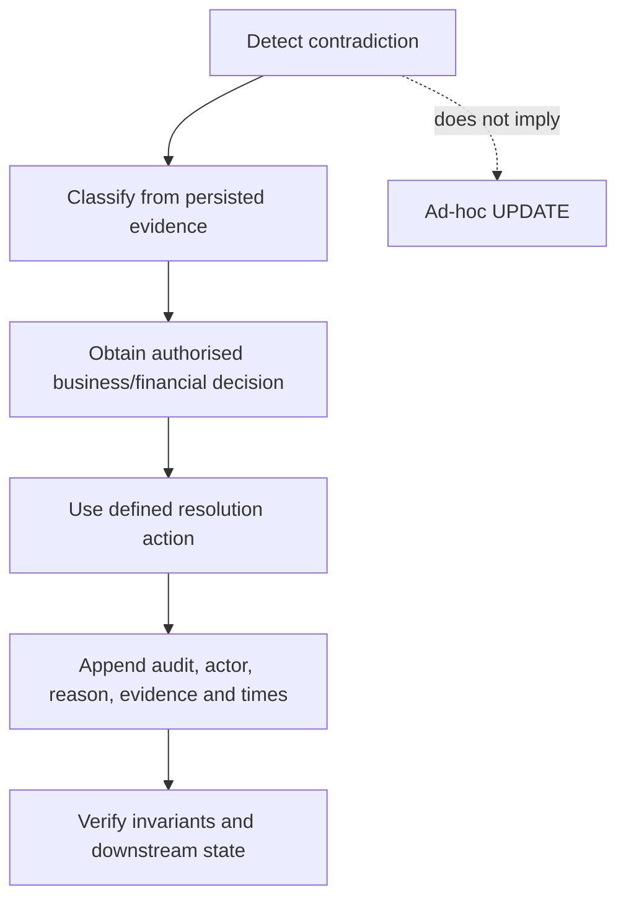

# Data history, migrations, and legacy members

The central historical-integrity rule is:

> Do not manufacture historical facts merely because the modern system expects modern records.

This applies to payments, programme state, Area state, network placement, funeral-cover inclusion, terms, obligations, commissions, and reconciliation.

## 1. The distinctions that protect history

```text
current state != historical evidence
legacy participation != modern payment transaction
migration != permission to invent history
reconciliation != arbitrary database editing
software deployment date != business effective date
```



```mermaid
flowchart TD
    Existing[Existing database state] --> Evidence{Authoritative evidence complete?}
    Evidence -->|Yes| Derive[Deterministically derive historical fact]
    Evidence -->|Incomplete but not contradictory| Leave[Leave untouched / not qualified]
    Evidence -->|Contradictory modern model| Stop[Fail closed]
    Stop --> Inventory[Read-only inventory and classification]
    Inventory --> Decision[Authorised reconciliation decision]
    Decision --> Audit[Audited resolution workflow]
    Evidence -. never .-> Guess[Invent payment, date, Area, or approval]
```

## 2. Authoritative facts and projections

| Concern | Strong historical evidence | Projection that is insufficient by itself |
| --- | --- | --- |
| Joining completion | Linked confirmed `MemberPayment` records with purpose, amount, currency, customer, tenant, and `ConfirmedAt` | Participation currently Active or awaiting approval |
| Programme activation | Append-only Area Admin decision and `ActivatedAt` | Payment receipt or browser success return |
| Funeral inclusion | Proven final joining-payment confirmation | Migration execution time, approval time, `UpdatedAt` |
| Network placement | Activation plus valid effective recruiter-correction history | Current recruiter ID alone for an old cutoff |
| Area state | Append-only Area activation records at cutoff | Area active today |
| Commission terms | Immutable terms row effective for the cycle | Current hard-coded terms or deployment date |
| Monthly compliance | Due/grace/payment timestamps and policy coverage | Current obligation status alone |
| Loan compliance | Effective date, due/satisfaction/repayment/deadline facts | Current outstanding/status projection alone |

## 3. Legacy AQGreen members

Legitimate Aqua members may predate modern application onboarding and have no `EntryParticipation`, checkout, or `MemberPayment` history. Their absence from modern tables is not proof that they did not pay or are not covered.

They are also not candidates for a migration based on modern payment evidence. The system must not:

- create placeholder customers;
- create fake R1,200 or R600 payments;
- invent confirmation timestamps;
- force already-covered legacy members through new-customer joining;
- infer an external insurer date from software data.

`PLANNED`: a future audited legacy-member import should capture identity, real AQGreen participation, known Aqua inclusion/cover facts, source evidence, authorising operator, business-effective date when known, and import recording time. Unknown dates must stay unknown. This workflow is not implemented by the funeral-cover migration.

## 4. AQGreen joining migration provenance

Migration `20260726162000_AddAQGreenSingleJoiningPayment` created `AQGreenMigrationBackup` before changing the joining model. The backup preserves each migrated participation's prior terms version and effective date so a later investigation can distinguish records transformed from an older lifecycle.

The backup is provenance, not a payment ledger. It cannot prove that a customer paid, approve a participation, or create a funeral entitlement on its own.

Its downgrade path refuses to proceed when new checkouts or confirmed joining history would make restoration unsafe. A verified database backup or reviewed forward remediation is required instead of a lossy downgrade.

## 5. Funeral-cover backfill

Migration `20260809043240_AddAQGreenFuneralCoverEntitlements` applies the same qualifying event used at runtime to modern in-system records.

### Deterministic candidates

The migration requires a live customer/tenant relationship and a supported modern AQGreen joining model. It creates one inclusion only when linked evidence proves either:

1. one confirmed ZAR 1,200 AQGreen joining payment; or
2. two distinct confirmed ZAR 600 AQGreen joining payments.

For the full path, `IncludedAt` is that payment's `ConfirmedAt`. For instalments, it is the later `ConfirmedAt`.



Incomplete payment is not ambiguity: it receives no entitlement and migration continues. Current Active/Rejected/awaiting status is not used as a shortcut.

### Contradictory modern data

The migration raises a clear PostgreSQL exception when a scanned modern record contradicts the required facts, including examples such as:

- customer/tenant mismatch or missing live customer;
- unsupported terms/amount/currency for the modern model;
- start before the terms boundary;
- mixed full and instalment references;
- reuse of one payment in both instalment slots;
- a completed-like status without qualifying linked payments;
- linked confirmed payments with wrong purpose, amount, customer, tenant, currency, or timestamp.

This `P0001` guard prevents the migration from “fixing” a contradiction by inventing history. See the active incident status in [document 04](04-payments-approval-and-yoco.md).

### Duplicate and rollback behaviour

- Backfill avoids an existing participation entitlement.
- A unique index on `EntryParticipationId` is the final duplicate guard.
- Runtime inclusion uses the same one-per-participation invariant.
- `Down` drops the entitlement table. After production use that destroys both backfilled and newly earned records. Safe operations require backup/restore or reviewed forward remediation; a synthetic rollback would be dishonest.

## 6. Decision uniqueness migration

Migration `20260809042322_EnforceSingleProgrammeParticipationDecision` adds the database invariant that a participation has at most one AQGreen or Onyx approval decision. It first refuses to proceed when historical duplicates exist.

The migration does not choose which contradictory decision is “correct.” That requires authorised reconciliation of the audit evidence.

## 7. Flexible joining migration

Migration `20260809052330_EnableAQGreenFlexibleJoiningPayments` introduces the selectable R1,200 or R600+R600 modern schedule while retaining historical payment links. Its rollback refuses to remove the capability after two-instalment history exists.

This chronology matters:

```text
decision uniqueness
    -> funeral-cover entitlement/backfill
    -> flexible joining support
```

The funeral migration recognises the authorised modern terms versions and linked payment facts. Migration filenames and order must not be rearranged merely to simplify presentation.

## 8. Monthly due-policy and checkout history

The monthly due-policy table starts empty and is append-only. A policy records a version, due day, and effective month boundary. Update, delete, truncate, and evidence-losing rollback are rejected after policy evidence exists.

Monthly checkouts link to a specific obligation. Contradictory or unlinked allocation becomes `ReconciliationRequired`; no oldest-open fallback is authoritative.

Discovery endpoints expose legacy joining and monthly checkout reconciliation rows to authorised Area/host operators. They are read-only. Issue #66 tracks the missing authorised resolution workflow.

## 9. Area activation baselines

Commission calculation needs to know whether a target Area was active at the historical cutoff. “The Area is active now” cannot prove that fact.

The append-only Area history supports prospective observation and change. It does not seed or backfill existing Areas from current state. Every existing-Area baseline must be explicitly authorised, and cutoffs before the first reliable record remain unknown.



## 10. Effective date versus deployment date

These are different concepts:

- **Business effective date**: when authorised terms or a state applies.
- **Payment confirmation time**: when a qualifying financial fact occurred.
- **Entitlement time**: the qualifying final payment's confirmation time.
- **Deployment time**: when code reached an environment.
- **Recording time**: when Aqua stored a fact or operator assertion.
- **External provider date**: an insurer/payment/payout fact only when the provider supplies authoritative evidence.

For funeral cover, 26 July 2026 is a technical lower bound for the supported modern joining model. It is not the funeral promise inception or external cover commencement. For commission terms, 14 August 2026 00:00 Johannesburg is the authorised initial cycle boundary, not merely the date software happened to deploy.

## 11. Reconciliation is a controlled process



The repository currently detects and lists several reconciliation states but does not expose a general audited resolution action. `ReconciliationRequired` is a stop signal, not permission to change financial history.

## 12. Production safety checklist for historical changes

Before a migration or reconciliation affecting historical facts:

1. take and verify a restorable backup;
2. inventory affected rows read-only and exclude PII from reports;
3. identify the authoritative source for each field;
4. distinguish incomplete from contradictory data;
5. obtain business authority for any interpretation;
6. test Up, fail-closed cases, uniqueness, and actual Down consequences on PostgreSQL;
7. preserve provenance and actor/reason evidence;
8. prefer reviewed forward remediation after production use;
9. never alter migration history to bypass a guard.
