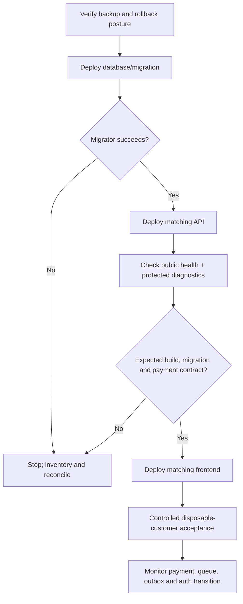

# Operations and enablement runbook

This runbook answers: “The capability exists—what must happen before we operate it?” It does not authorise a deployment or production data change.

## Area/Tenant migration gate

Before programme operations, apply and verify `SeparateAreaFromTenantBoundary` using the checklist in [document 08](08-area-and-tenant-boundaries.md). The technical Tenant must remain `Default`; Johannesburg is the business Area `JHB`. Confirm customer and administrator assignment counts, and stop if any participation lacks a same-Tenant Customer Area. Do not manufacture historic movements. After production use, rollback destroys Area assignment history, so prefer a reviewed forward repair or controlled database restoration.

## 1. Readiness language


Each step needs its own evidence. A passing test does not prove deployment. A deployed worker with its flag off is not enabled. An enabled worker with no observed successful business cycle is not production verified.

Current capability status is in [document 07](07-verification-decision-and-risk-register.md).

## 2. Safe payment/approval deployment order



Conceptual order:

1. Verify a restorable database backup and migration rollback limitations.
2. Run the repository migrator through the deployment platform's pre-deploy step.
3. Stop if a migration fails closed; do not edit `__EFMigrationsHistory` or weaken the guard.
4. Deploy the API that matches the schema.
5. Verify `/api/health` and the protected operations diagnostics: build ID, environment, database fingerprint, latest migration, payment contract, and required capabilities.
6. Deploy the matching frontend only after API compatibility passes.
7. Use clean disposable actors for a controlled joining/payment/approval/rejection acceptance.
8. Observe structured alerts and durable records before wider payment acceptance.

The frontend compatibility guard is a safety feature. Do not bypass it to accept money during a mixed deployment.

## 3. Weekly commission enablement

`PLANNED / NOT ENABLED`

Repository default: `App:WeeklyCommissions:Enabled=false`.

Authorised initial boundary:

```text
First automated/effective-dated cycle: Friday 14 August 2026
through Thursday 20 August 2026
Timezone: Africa/Johannesburg
Automatic earlier backfill: NONE
```

This boundary controls the engine's first automated terms version. It does not claim that Aqua's underlying commission model was created on 14 August 2026.

### 3.1 Prerequisites

Do not arm the worker until all are evidenced:

- [ ] Current production schema is migrated and healthy.
- [ ] `2026-08-14-entry-initial` and `2026-08-14-onyx-initial` terms bootstrap dry-run is conflict-free, then the authorised rows are inserted and re-read.
- [x] The AQGreen evaluator and commission terms enforce the client-confirmed three-level model. Level 3 is final; Onyx separately remains a five-level programme.
- [ ] Every Tenant has authorised cutoff-applicable activation-state evidence under the legacy `AreaActivationStateRecord` name; no current-state guess is used.
- [ ] Every configured Tenant uses the host database topology supported by the current worker. Same-Tenant business Areas do not split the programme graph.
- [ ] Target Friday-to-Thursday cycle and Johannesburg boundary are correct.
- [ ] Read-only enablement preflight reports no missing/ambiguous terms, unknown Area state, or existing conflicting target period.
- [x] PostgreSQL application-path rollback/retry idempotency has local real-provider evidence for AQGreen L1. Production-like E2E and production state remain separate gates.
- [ ] Production-like weekly E2E covers positive, hold, inactive/unknown Area, post-cutoff activation/placement, and retry cases.
- [ ] Missed-cycle detection and authorised recovery runbook are approved.
- [ ] Structured monitoring and an owned alert destination exist.
- [ ] Release and external payout remain separately controlled; operators know calculation sends no money.

Open issues #55–#60 track these gates. Issue #59's text refers to archived WIP; current `main` contains a smaller bootstrap/preflight capability in `AdminCommissionBootstrapAppService`, but completion against the issue's full acceptance criteria has not been established.

The focused [weekly production-readiness assessment](../operations/weekly-commission-production-readiness.md) defines current blocker codes, startup timing, structured evidence, and the boundary between a one-cycle controlled test and continuous operation.

### 3.2 Enablement

1. Freeze unrelated financial/data changes during the window.
2. Verify `App__EntryMonthlyObligations__Enabled=false`, capture preflight output and approvals without PII or credentials, and stop unless `Ready=true` with no blockers.
3. Under a separate approval, enable `App__WeeklyCommissions__Enabled=true` in one controlled environment. `App__WeeklyCommissions__RecoveryVerified` and `App__WeeklyCommissions__ObservabilityReady` are evidence assertions, not worker switches; do not set them without retained restore and alert-delivery proof.
4. Redeploy/restart only the required API service.
5. Confirm exactly one worker execution owns the advisory lock.
6. Verify period dates, terms versions, Area outcomes, counts, totals, and no duplicate rows.
7. Leave release/payment manual until calculation evidence is reviewed.

### 3.3 First-run evidence

Operators must retain:

- build/image and migration identifiers;
- worker configuration and run time;
- resolved cycle start/end/timezone;
- selected terms versions;
- Area active/inactive/unknown summary;
- periods and commission row counts per Tenant/programme;
- Earned/Held/NotEarned totals;
- idempotent repeat outcome;
- alerts/failures and their owner;
- approval to continue or disable.

No customer PII or provider secrets belong in this evidence.

### 3.4 Abort conditions

Disable the worker and investigate if any of these occurs:

- missing or ambiguous terms;
- unknown target-Area state;
- database topology differs from the preflight assumption;
- migration/model mismatch;
- unexpected existing or duplicate period;
- PostgreSQL lock/uniqueness behaviour differs from tests;
- current-state data is proposed as historical cutoff evidence;
- unexplained totals, new `ReconciliationRequired` rows, or material alerts;
- the run attempts an earlier automatic backfill.

Do not delete a ledger row and rerun. Historical correction needs an authorised audited process.

### 3.5 Missed cycles

The worker calculates only the latest closed cycle. Older missing cycles are not safely reconstructed from today's state. Preflight blocks the controlled first run when `RunOnStart` would select a later cycle. Operators must detect and classify a missed cycle, preserve evidence, and obtain an authorised recovery decision. There is no approved manual SQL procedure in this pack, and automatic arbitrary backfill is not required for the first-cycle MVP.

## 4. AQGreen monthly automation

`PLANNED / NOT ENABLED`

Repository default: `App:EntryMonthlyObligations:Enabled=false`.

Intended first automatic month: **September 2026**.

`UNRESOLVED`: `DueDayOfMonth`. Aqua must authorise a day from 1 to 28. No operator or developer may choose it for convenience.

### 4.1 Prerequisites

- [ ] Issue #61 records the business-authorised due day and consequences.
- [ ] The immutable September due-policy is dry-run, conflict-checked, inserted, and re-read.
- [ ] Existing-member handling and first-month boundary are authorised.
- [ ] Monthly end-to-end acceptance covers generation, member visibility, obligation-specific checkout, signed payment, allocation, grace/overdue, duplicate delivery, and multiple months.
- [ ] Manual resolution for `ReconciliationRequired` is defined and audited (issue #66).
- [ ] Yoco production finality/acceptance is complete where real provider evidence is required.
- [ ] Monitoring and disable/rollback posture are approved.

### 4.2 First run

1. Confirm the due-policy version and effective Johannesburg month boundary.
2. Enable the monthly worker in isolation.
3. Verify exactly one obligation per Active AQGreen participation for the target month.
4. Repeat scheduling and prove no duplicates.
5. Verify no obligation is created for non-Active participation.
6. Verify due and grace times, policy version, amount, and currency.
7. Complete one controlled obligation-linked payment and verify exact allocation.
8. Confirm no joining or Onyx repayment payment was reused.
9. Review every reconciliation row before expanding rollout.

## 5. Enable one worker at a time

Weekly commission and monthly obligations influence the same financial story. Enabling both together obscures causality if obligations, holds, or ledgers differ from expectation.

Enable and observe one capability through a complete expected cycle before enabling the next. Keep its reversible configuration change, evidence owner, and disable procedure explicit.

## 6. Yoco controlled acceptance

Prerequisites:

- test/live keys and webhook secrets remain server-only and match the configured mode;
- public domain/webhook registration is confirmed in Yoco;
- frontend and API payment contract match;
- migration incident and database state are resolved/healthy;
- alerts for deferred processing and stale checkouts have a monitored destination.

Acceptance must prove with a clean actor:

1. hosted checkout creation;
2. a real signature-verified provider delivery;
3. exactly one receipt, payment, and completed checkout;
4. correct AQGreen stage or direct-Onyx awaiting-approval state;
5. duplicate delivery idempotency and conflicting replay rejection;
6. Area queue discovery and decision;
7. no payment-only activation;
8. provider/local comparison for a deliberately pending or failed scenario.

A correctly signed local simulation proves the application handler, not Yoco delivery. A successful browser return proves neither.

## 7. Approval and email operations

The queue remains usable without email. For Bird:

- verify domain/DNS and least-privilege server credentials;
- verify the outbox record is created with the business transaction;
- distinguish queued, claimed, Bird-accepted, and recipient-delivered;
- preserve Data Protection keys while protected pending messages exist;
- monitor terminal delivery failures by outbox ID, never by message body;
- do not claim final delivery until provider delivery/bounce evidence exists.

Email failure must never activate, reject, or remove an approval item.

## 8. Reconciliation response

When a guard or workflow returns reconciliation-required:

1. stop the affected transition;
2. preserve the error, build, migration, and non-PII identifiers;
3. inventory read-only;
4. classify incomplete versus contradictory evidence;
5. assign Finance/Ops and business ownership;
6. use only a defined, authorised, audited resolution action;
7. verify payment, participation, entitlement, obligation, and ledger invariants afterward.

There is no approved “just UPDATE the row” fallback. Detection is implemented more broadly than resolution.

## 9. Current production incident boundary

The P0001 AQGreen migration incident is under an active, unmerged reconciliation workstream. This runbook does not authorise applying remediation, accepting production payments, or declaring the migration deployed. Use [document 07](07-verification-decision-and-risk-register.md) for current status and [document 05](05-data-history-migrations-and-legacy-members.md) for the data-integrity rule.
