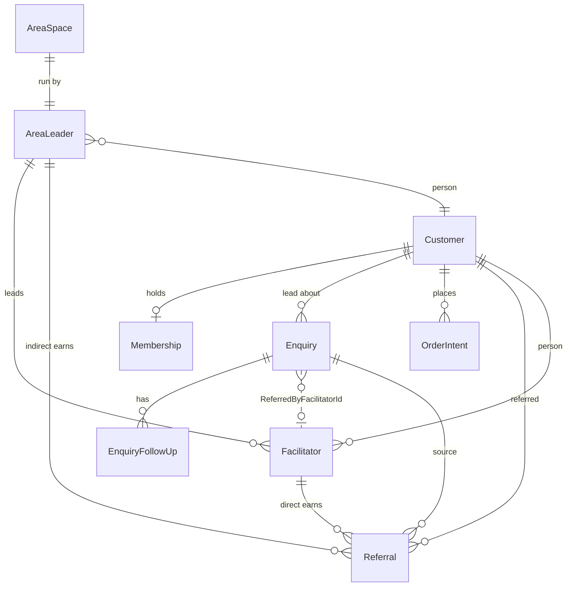

# Technical Requirements: Area Network, Referrals, Admin & Enquiry Relationship

Source of truth for the implementation in branch `feature/business-docs-gap-analysis`.

## 1. Scope

In scope: Area Leaders, Facilitators, Referrals, their relationship to Enquiries and Customers, a real
Admin (auth + RBAC), and a network dashboard. Savings is **deferred** (see ADR / `docs/MissionPlan.md`).

## 2. ERD (existing + new)

### 2.1 New tables

| Table | Grain | Key constraints |
|-------|-------|-----------------|
| `Facilitators` | one row per facilitator | `CustomerId` FK→Customers, `AreaLeaderId` FK→AreaLeaders, `TenantId`=not null, `Rank` enum, `DirectReferrals>=0`, `IndirectReferrals>=0`, soft-delete |
| `Referrals` | one row per attributed referral | `ReferrerFacilitatorId?` FK→Facilitators, `ReferrerAreaLeaderId?` FK→AreaLeaders, `ReferredCustomerId` FK→Customers, `SourceEnquiryId` FK→Enquiries, `Type` enum (Direct/Indirect), `AwardAmount` decimal, `AwardIssued` bit, `ConvertedAt` |
| `AreaLeaders` | one row per area leader | `CustomerId` FK→Customers, `LicenseType` enum, `Rank` enum, `AreaSpaceId?` FK→AreaSpaces, `DirectReferrals>=0`, `OrderTarget>=0`, `TenantId` |
| `AreaSpaces` | one row per area space | `AreaLeaderId` FK→AreaLeaders, `Status` enum, `PresentationsCompleted>=0`, `StartupOrdersCompleted>=0`, `ReviewStartedAt?`, `Capacity` string, `TenantId` |

All new tables implement `IMustHaveTenant` (audit + soft-delete via `FullAuditedAggregateRoot<int>`).

### 2.2 Modified tables

| Table | Change |
|-------|--------|
| `Enquiries` | Added nullable `ReferredByFacilitatorId` (FK→Facilitators). Domain raises `EnquiryConvertedEvent` on conversion. |

## 3. Business rules (cross-reference)

| Rule | Source | Implementation |
|------|--------|----------------|
| Enquiry conversion must create/link Customer + assign tier | MissionPlan §2 | `ConvertToCustomerAsync` injects `ICustomerRepository`/`IMembershipRepository`; assigns membership on the already-referenced Customer |
| Area Space approval requires 20+ interested, 4 presentations, 42h review window, 20 startup orders | `workflows.md` §6 | `AreaSpace.Approve()` Fail-Fast guards |
| Facilitator rank by direct referrals | `workflows.md` §7, `domain-model.md` | `RankProgressionPolicy` over `FacilitatorRankConfiguration` |
| Area Leader rank by order target | `workflows.md` §6 | `RankProgressionPolicy` over `AreaLeaderRankConfiguration` |
| Cap of 300 Area Leaders | `workflows.md` §6 | `AreaLeaderAppService.Apply` guard / `AreaSpaceApprovedEvent` handler |
| Referral → direct (facilitator) + indirect (area leader) | MissionPlan §2 | `ReferralAttributionService` |
| Commission award on rank-up | `workflows.md` §7 | `CommissionCalculator` over seeded amounts (flagged V-03) |

## 4. NFRs

- **Test coverage:** 85%+ on new business code; unit ≫ integration ≫ e2e.
- **Layering:** `Core` has no EF/ABP framework references beyond ABP base classes; repositories are ports in `Core`, EF impls in `EntityFrameworkCore`.
- **Security:** least privilege; all financial/approval actions authorized (`[AbpAuthorize]`) and audit-logged (FullAudited base).
- **Performance:** network overview is a read model (Specification-backed), no N+1.
- **Multi-tenancy:** tenant isolation via `__tenant` header (frontend) and `IMustHaveTenant` (backend).
